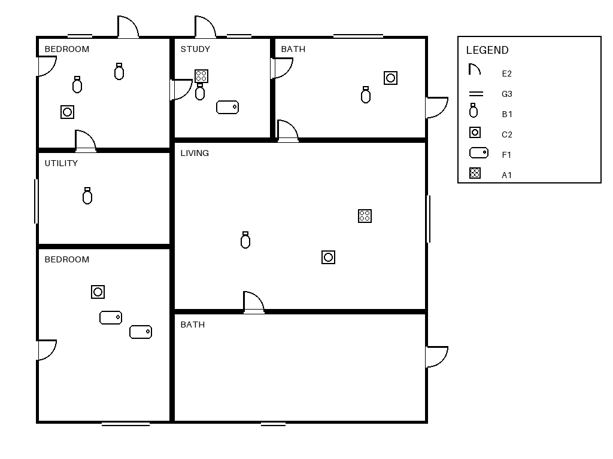

# blueprint-vlm

Fine-tuning a vision-language model to read architectural floor plans and produce a
quantity takeoff — with the evaluation built before the model.

The interesting part is not the fine-tune. It is that the task is constructed so a
model **cannot** answer it from the drawing alone, and so that the cost of the
cross-reference step can be measured on its own.

---

## The task

Each plan carries a legend mapping an arbitrary code (`A1`, `G3`, …) to a symbol
glyph. **The code→glyph mapping is reshuffled on every image.** A question asked by
code therefore forces three steps:

1. read the legend,
2. ground the glyph on the drawing,
3. count the instances.

A model that memorises "doors look like an arc" scores well on `count_by_name` and
falls over on `count_by_code`. That gap is the number this repo exists to measure.
It is the same cross-sheet reference pattern real construction drawings use — a
symbol on one sheet, defined in a legend on another — reduced to something with
exact ground truth.



Four task types:

| task | question | legend lookup | purpose |
|---|---|---|---|
| `count_by_name` | "how many door symbols" | no | control |
| `count_by_code` | "how many `G3` symbols" | **yes** | isolates the cross-reference |
| `takeoff` | full JSON, every legend code | **yes** | the product-shaped task |
| `room_tally` | rooms by name | no | text axis, not symbols |

### Labels are count maps, never lists or sets

`room_tally` returns `{"BEDROOM": 3, "BATH": 1}`, not `["BEDROOM", "BATH", "BEDROOM", "BEDROOM"]`
and not `["BEDROOM", "BATH"]`.

A **list** carries an order that is an artefact of how the generator recursed, not
anything a reader could derive from the drawing, so the model would be scored on
reproducing an implementation detail. A **set** throws the count away, and "how many
bedrooms" is exactly what a takeoff has to answer.

A count map is order-free and count-preserving, and it is the same shape as `takeoff`,
so one scoring path covers both. Repeated rooms are drawn numbered (`BEDROOM 1`,
`BEDROOM 2`) the way an architect would, so the label is recoverable from the image.

---

## Results

> Run pending — fill from `scripts/score.py` output. Zero-shot baseline first,
> then the fine-tune, both from the same inference script.

<!-- RESULTS:START -->
<!-- RESULTS:END -->

---

## Reproduce

Data generation and scoring are CPU-only and take about a minute. Training needs
one 24GB GPU.

```bash
pip install -r requirements.txt
python scripts/build_dataset.py --out data/synth
```

```
train       2000 plans    6000 records
dev          300 plans     900 records
test         400 plans    1200 records
test_hard    200 plans     600 records  [shifted]
```

Zero-shot baseline, then fine-tune, then score:

```bash
python -m blueprint_vlm.infer --config configs/qwen25vl_3b_lora.yaml \
    --split data/synth/test --out results/zeroshot_test.json

python -m blueprint_vlm.train --config configs/qwen25vl_3b_lora.yaml

python -m blueprint_vlm.infer --config configs/qwen25vl_3b_lora.yaml \
    --split data/synth/test --adapter outputs/qwen25vl-3b-lora \
    --out results/finetuned_test.json

python scripts/score.py --split data/synth/test \
    --predictions results/finetuned_test.json --out results/finetuned_test_scored.json
```

`notebooks/colab_train.ipynb` runs the same thing on a rented GPU.

---

## Method

- **Model** — Qwen2.5-VL-3B-Instruct, 4-bit QLoRA (r=32) on the attention and MLP
  projections. Vision tower frozen: 2,000 plans is not enough signal to retune it.
- **Resolution** — floor-plan symbols are ~22px against a 28px patch grid, so
  `max_pixels` is the most sensitive knob in the run. Sweep it before tuning
  anything else; it moves the counting tasks more than the learning rate does.
- **Output** — strict JSON with a `confidence` label the model emits itself.

## How this is evaluated

The eval was written before the model was touched. Specifically:

- **Held-out seeds are fixed in `splits.py`** and disjoint from training. Nothing in
  the design loop reads them.
- **A second held-out set shifts the distribution** (`test_hard`: 11 rooms and ~64
  symbols per plan against 4 and ~25). It separates "learned the task" from "learned
  this generator".
- **The zero-shot baseline runs through the same inference script** as the fine-tuned
  model, so the delta is attributable to the adapter and nothing else.
- **The control task isolates one variable.** `count_by_name` minus `count_by_code`
  is the cost of the legend lookup, and nothing else differs between them.
- **Confidence is scored, not decorative.** Accuracy alone does not say whether a
  takeoff is usable. `high_precision` at a given `high_coverage` says whether the
  model knows when to stop and ask a human — which is the number that decides
  whether a system like this can be deployed at all.
- **Variance before deltas.** Repeat runs at a fixed config to establish noise, and
  do not report an improvement smaller than it.

## Limitations

Stated plainly, because they bound what the numbers mean:

- **The data is synthetic.** Real drawings bring scan noise, hand annotation,
  overlapping linework, inconsistent CAD conventions and multi-sheet cross-references
  this generator does not produce. These numbers are an upper bound.
- **Counting is a proxy for takeoff**, not takeoff. Real takeoff needs scale,
  dimensions and material assignment.
- **One model family.** No claim is made about Qwen2.5-VL against InternVL or Molmo.
- **The vision tower is frozen**, so the encoder never adapts to line drawings — a
  likely ceiling on the counting tasks.

## Layout

```
src/blueprint_vlm/
  synth.py      synthetic plan generator (PIL, deterministic by seed)
  tasks.py      plan -> prompt/target records
  splits.py     seed ranges, fixed once
  data.py       torch dataset + collator, prompt masked in the labels
  train.py      QLoRA SFT
  infer.py      batched inference, with or without the adapter
  evaluate.py   exact match, MAE, JSON validity, confidence calibration
scripts/
  build_dataset.py
  score.py
```

MIT licensed.
